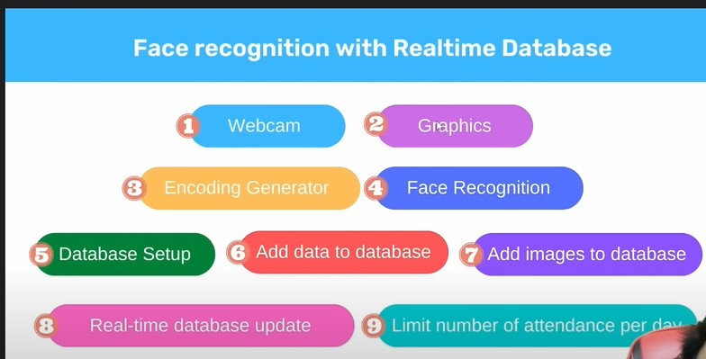

# Face Recognition with Real-Time Database

A real-time Face Attendance system, an elegant graphical interface along with a live database (firebase) integrated

  

## Overall features
1. **Introduction** 
2. **Overview** 
3. **Setup**
   
    - Library Installation: `pip install -r requirements.txt`

    - face_recognition requirements: Install the extension "tools for CMake" in Visual Studio

4. **Webcam** 
5. **Graphics**
   
    Put images background and modes as a main frame application

6. **Encoding Generator**
   
    A way to represent the face using a set of 128 computer-generated measurements

7. **Face Recognition**

    Create a bounding box around the faces using cvzone (more vancy than opencv)

8. **Database Setup**

    Storage and Real Time Firebase Integrated

9.  **Add Data to the Database**

    Recognized person data

10. **Upload Images to the Database**
    
11. **Download User Data**

    In order to display data into Graphics

12. **Update Attendance**

    Iteration of Attendance number

13. **Check if already Marked**

    Limit attendance number in every 30s

14. **Loading Graphics (cvzone)**

    Ignoring the lagging while rendering the face 

  

## References
1. [Face Recognition Libraries](https://github.com/ageitgey/face_recognition) 
2. [Youtube Course](https://youtu.be/iBomaK2ARyI)
3. [Medium Post](https://medium.com/@ageitgey/machine-learning-is-fun-part-4-modern-face-recognition-with-deep-learning-c3cffc121d78)

## License
MIT